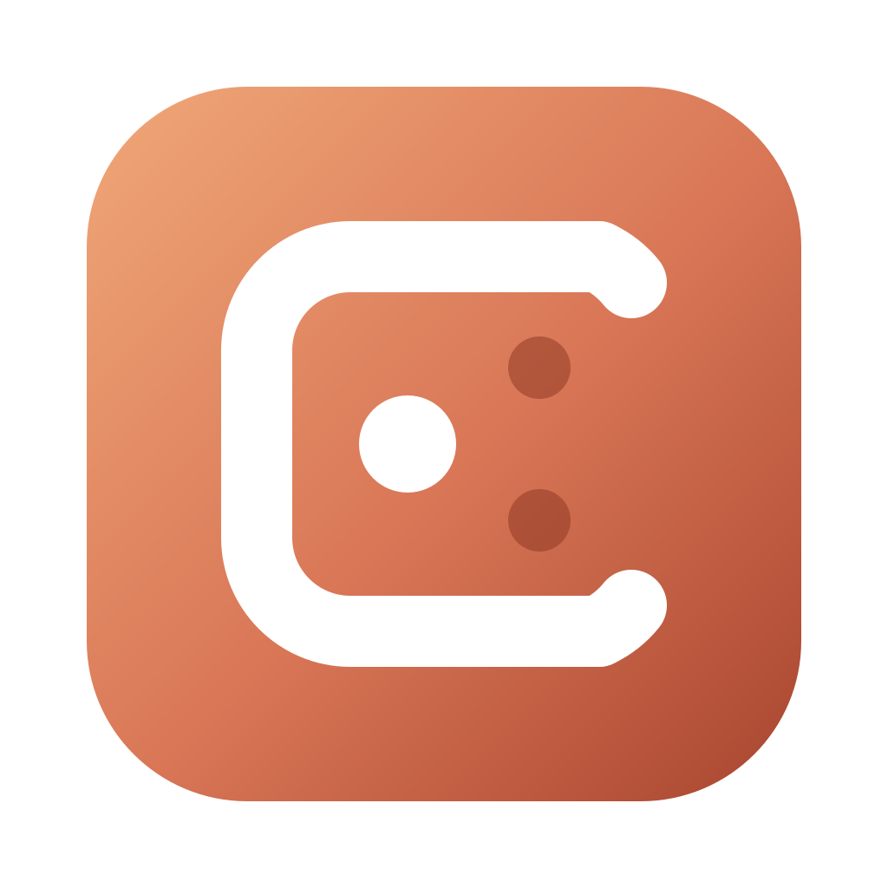

<div align="center">



# Corral

**Activity Monitor for Your Local AI Agents**

A free, open-source, native macOS app that shows you every Claude Code, Codex,
Cursor, Kiro and Antigravity process on your machine — what project it belongs
to, how long it has been sitting there, and how much of your Mac it is holding.

[](LICENSE)


</div>

## Why

Open Activity Monitor while you have a few agent sessions going and you get
this:

```
2.1.228    5,8%   6:46:58.81   39 threads
2.1.231    2,0%   1:18:17.04   39 threads
2.1.228    1,5%   1:48:52.33   39 threads
2.1.228    1,5%   1:23:59.63   39 threads
2.1.232    1,2%   1:13:19.57   39 threads
```

Fifteen identical rows named after a version number. Claude Code installs itself
as `~/.local/share/claude/versions/2.1.228`, so the process name *is* the
version — and nothing on that screen tells you which of them is the session you
abandoned in a repo last Tuesday and which is the one doing your actual work.

So people reach for `pkill -9 -f claude`, kill everything including the session
they were in the middle of, and move on.

Corral shows you the same processes with the one fact that makes them
distinguishable — **the working directory** — plus how long each has really been
idle, what it spawned, and what it is costing you.

## What it shows

- **The project, not the version.** Each agent is identified by its working
  directory, so the list reads `heroshot`, `recall`, `appcleaner` — not
  `2.1.228` five times.
- **Honest idle time.** Not "quiet since this app opened": Corral reads the last
  write to each agent's controlling terminal, which the kernel has been stamping
  all along. An agent you walked away from on Tuesday says `idle 3.1d` the first
  second you open the window.
- **The whole footprint.** Every agent's children — MCP servers, `node` helpers,
  the `caffeinate` that has been quietly stopping your Mac from sleeping — and
  the memory they hold together.
- **Where it came from.** Executable path, full command line, parent process,
  controlling terminal, start time.
- **What is safe to reclaim.** Agents idle for over an hour, totalled, behind one
  button. Anything still working — including an agent waiting on a build it
  started — is never in that total.
- **A menu bar item.** Corral keeps running with its window closed — and
  leaves the Dock while it does, so a monitor in the background is not a tile
  you have to look at. The top right shows the busiest agent's CPU — or just
  how many are running when nothing is working hard. Hover for the summary,
  click for the list, click a row to open the window on that agent, and Quit
  is on the same menu when you want it gone for real.
- **The tool's own icon.** Taken from the copy of Claude, Cursor or ChatGPT
  already installed on your Mac, the same way Finder draws it. Corral ships no
  brand artwork; a tool you do not have installed falls back to a symbol.
- **Where the numbers have been.** One graph in the header, plotting CPU by
  default. Click a figure — agents, memory, projects, cores — to plot that one
  instead; click the graph to switch between 15 minutes, 1 hour and 3 hours.
  "2.92 GB" cannot tell you whether that is the calm after you closed six agents
  or the start of a climb; the graph can. Point at a column to read what it held
  and how far back it sits.

  The axis is fixed: now at the right edge, running back the full range in
  10-second, 30-second or 1-minute slices. Two minutes of history fills two
  minutes of a three-hour graph and leaves the rest empty, rather than being
  stretched across it — and a stretch when Corral was not running stays empty
  too, because it will not draw across a sleep it did not observe.
- **Light or dark.** Corral follows the system, or you can pin it either way
  from the app menu or the menu bar item — a window you leave open all day is
  the kind you might want dark on a light desktop.
- **Sorting.** By how long it has been running (the default — the thing you
  forgot about is the thing you came here to find), by memory, by CPU across the
  whole group, or by project name. Each order has an obvious direction, so
  picking one applies it; picking the same one again reverses it. Remembered
  between launches.
- **Search.** ⌘F in either pane. An agent matches on its project, path, tool,
  version, pid, terminal, command line — and on what it spawned, so searching
  for an MCP server finds the agent running it.
- **What they left on disk.** A second tab measures every cache, superseded
  version and log the tools have accumulated, sorted by how safe it is to
  remove. On the machine this was written on that came to 14 GB.

Supported: **Claude Code**, **Claude** (desktop), **Codex**, **Cursor** and its
CLI agent, **Windsurf**, **Kiro CLI**, **Kiro Crew**, **Kiro** (the IDE) and
**Antigravity**.

## What the colours mean

Every row carries a dot. There are five states, and each one is a different
decision:

| | State | Means |
|---|---|---|
| 🟢 | **working** | Using the CPU, or writing to its terminal right now. |
| 🔵 | **waiting** | The agent is parked, but a build, test run or MCP server *it started* is busy. It is waiting on its own work. |
| ⚪ | **idle** | Nothing for under an hour. Normal between prompts. |
| 🟡 | **idle** (amber) | Nothing for an hour to a day. Worth a look. |
| 🔴 | **abandoned** | Nothing for over a day. Almost certainly forgotten. |

The same legend is in the app, behind the **?** next to the search field.

**How it is measured, and what that cannot see.** Corral watches two things: how
much CPU a process has used since the last sample, and the last write to its
controlling terminal. It does not watch the network, so an agent waiting on a
reply from the model is, strictly, doing neither. In practice that gap stays
green: CLI agents animate a thinking indicator while they wait, and that redraw
is a terminal write. Output within the last 30 seconds counts as working.

Two honest limits:

- **`waiting` is inferred from children, not from the agent.** A `swift build`
  burning a core proves its agent is working; an agent thinking quietly with no
  children and no output does not look busy, because nothing observable says it
  is. Before this existed, such a group read as plain `idle` — and was offered
  up to the Reclaim button along with the genuinely forgotten ones.
- **An agent with no controlling terminal has only CPU to go on.** Its idle time
  can then only reach back to when Corral opened, which is why those rows say
  "quiet since Corral opened" rather than "idle", and why they are never
  bulk-stopped. `corral list` makes the same distinction in text.

## Usage

How much have you got left, and how full is each conversation. Two different
questions: an allowance belongs to the account and refills on a clock, a context
window belongs to one conversation and is the only one of the two you can do
something about right now.

They show in three places — a line on the right or left edge of the screen (or a
strip at the top) that opens into a ring per vendor when you go near it, a
**Usage** tab in the window, and
the fullness of each conversation in its own row of the agent list.

Where the figures come from differs by tool, and Corral says so rather than
leaving a gap:

| | Allowance | Context |
|---|---|---|
| **Codex** | from its own rollout logs, unasked | yes |
| **Claude Code** | needs the status line, below | yes |
| **Cursor** | not published anywhere on your Mac | needs the status line |
| **Kiro CLI**, **Kiro Crew** | asked of Kiro's servers, if you turn that on | yes, from its session files |
| **Antigravity** | not published; conversations are encrypted | no |

Codex writes its limits into every session log it keeps, so those are free. The
other two record nothing — but both hand their figures to a status line command
on every update, and Corral can be that command. Turn it on from the menu bar
item, **Report Usage to Corral**, or from the Usage tab. It asks first, shows
the exact setting it will add to `~/.claude/settings.json` or
`~/.cursor/cli-config.json`, keeps a timestamped copy of the file, and refuses
to touch a status line you already set up.

The **Usage** tab has a *Reporting* section saying, in a sentence per tool,
whether Corral is being told anything and what to do if it is not — including
when everything is already on. It used to appear only inside a panel that had no
figures, which put it out of sight exactly when someone came looking: a tool
reporting nothing because it has not run looks identical to one reporting
nothing because it was never asked to. Codex is listed there too, with nothing
to press: it writes its limits into its own session logs, and while it does have
hooks — the same seven events Claude Code has — their payload carries session
and tool metadata and no usage at all, so a status line would add nothing. What
refreshes Codex is running Codex.

Kiro is the third kind. Kiro CLI writes every session to
`~/.kiro/sessions/cli/` — the working directory, how full the window is and
what each turn cost, in credits — and a lock file naming the process holding
it. That pid is a descendant of the `kiro-cli` Corral lists, so the match is
exact where every other reader has to reason from paths and times. Kiro Crew's
agents are Kiro CLI engines it starts per session, so they read the same way
and are listed under the Crew app.

What the account has left is not on this Mac at all, and this is the one place
Corral will use the network — off until you turn it on, from **Report Usage to
Corral → Ask Kiro for Account Usage** or the Usage tab. It asks first, in a
dialog that says exactly what happens: every five minutes Corral reads the
sign-in token Kiro CLI keeps in its own store, sends one HTTPS request to the
fixed AWS host the Kiro IDE itself uses (`GetUsageLimits`), and keeps the
numbers that come back — credits used, the plan's limit, when it resets, any
bonus pool. The token is held for one request and never written down or
logged; the request follows no redirects; Corral never refreshes the token, so
when it runs out the panel says to run Kiro CLI, which does. Turning it off
forgets the figures.

Antigravity keeps its conversations encrypted — the bytes are random from the
first one — and fetches its per-model rate limits from Google when the app
asks. What it does leave readable is its own list of conversations, with a
title, a workspace and the time of the last write, and that is what Corral
shows: what the agent last worked on, in which project, and how long ago.

What Corral keeps out of what those tools send is the session id, the working
directory, the context size and any limit percentages. Not the transcript path,
not the branch, not the pull request — the payload describes what you are
working on, and none of that is any of its business.

Every figure carries the date the tool wrote it. They are a by-product of the
last turn an agent took, so a tool you have not run this week reports a
week-old percentage, and one shown bare would read as current.

### Which models

Under the allowance, the same panel says which models did the spending, over
the last five hours and the last seven days. That one is counted rather than
reported: every assistant turn in a session log names the model that produced
it and the tokens it took, so the arithmetic is Corral's own.

It is a share of **output**, and it is labelled as one. Input is mostly cache
reads — 621 million of them against 2.7 million produced tokens, on the machine
this was written on — so a bar drawn on the total would be a bar about caching.

Kiro's is counted in **credits**, because that is what Kiro writes: every turn
carries the metering entries it was billed, and its token fields are zero. The
bars for Kiro are shares of credits and say so. Antigravity's are not counted
at all — there is nothing readable to count — and the panel says that too.

Codex is read from two places. Its rollout logs give a turn-by-turn split and
are used wherever they exist; alongside them it now keeps a SQLite database with
a row per session, and that is read for sessions no rollout file describes. The
database is opened read-only, and only the four columns this needs are named —
the same table holds the first message of every session, its title and its git
branch. It reports one figure per session with no split anywhere in it, so a
breakdown that draws on it is about **tokens** rather than output and says
`Tokens by model` instead. Codex keeps a `rollout_migration_state` table of its
own, which is it saying the JSONL files are on their way out; when that day
comes, this keeps working.

A *limit* per model is a different thing, and it is not available. Claude Code
does track `seven_day_opus` and `seven_day_sonnet`, but writes neither to disk
nor to its status line; every limit Codex reports is stamped `limit_id: "codex"`
with no model in it. The vendors also weight models against each other in ways
nothing local can see, so a model with 40% of the output has not necessarily
taken 40% of the week — and Corral does not say it has. Reading those would
mean asking the vendor's servers, and the line below would stop being true.

Still no network. These are files the tools put on your machine.

## What it costs to run

A monitor that shows you what is eating your CPU has no business being on that
list. A refresh takes **~8 ms** across ~550 processes — 0.4% of one core at the
two-second refresh rate. Measure it yourself with `Corral --bench`.

That took work. The first version read every process's argument vector every
tick, which allocates a megabyte a time, and cost 17% of a core. The fix is that
almost nothing about a process changes: its path, its arguments, its terminal
and what tool it belongs to are all fixed at birth, so they are asked once and
cached against the pid and its start time. Only memory and CPU are re-read.

Counting a week of transcripts for the per-model figures is a different size of
job — 296 MB of session logs on this machine — and it never runs on that timer
or on that thread. Transcripts nobody has written to in a week are not opened;
the rest are read backwards from the end and abandoned as soon as the week runs
out, which is 82 MB rather than 296 MB; and after the first pass each file is
read from where the last one stopped. That is **~3 s** once, in the background,
and **~30 ms** every refresh after it. Written the obvious way — `Data` split by
`Collection.split`, which walks it a byte at a time through the protocol — the
same pass took over four minutes.

## On disk

```
  20 items · 13,97 GB total
  (skipping versions in use: 2.1.227, 2.1.228, 2.1.231, …)

  SAFE TO CLEAR — 1,44 GB
    554,9 MB    Network cache            ~/Library/Application Support/Claude/Cache
    294,7 MB    Superseded versions      ~/.local/share/claude/versions/2.1.229
    …
  WILL BE DOWNLOADED AGAIN — 11,94 GB
    10,89 GB    Local agent VM image     ~/Library/Application Support/Claude/vm_bundles
     1,05 GB    Plugin cache             ~/.claude/plugins/cache
  YOUR DATA — 591,9 MB
    520,6 MB    Conversation history     ~/.claude/projects
```

Three groups, because "reclaimable" is not one thing:

- **Safe to clear** — caches the app rebuilds by itself. Ticked by default.
- **Will be downloaded again** — big, and fetched again on demand. Your call.
- **Your data** — transcripts, undo history, extensions. **Never** ticked for you.

A version that is currently running is never offered, whatever its number says.
Everything goes to the Trash, never `unlink`.

## Install

Download the latest `Corral-<version>.dmg` from the
[releases page](https://github.com/popyapp/corral/releases), open it and drag
Corral to Applications. Every commit on `main` publishes a build, each one
listing its SHA-256 and the exact commit it came from — `Corral --version`
prints that commit back to you, and **About Corral** shows the same pair as
`Version 0.1.5 (a1b2c3d)`, with the hash linking to that commit on GitHub.

A build made locally with `make app` has no release number, so it takes one
from git instead: the last release tag plus how far past it the tree is, as
`0.1.5+3`. If the tree had uncommitted changes the hash carries a `-dirty`
suffix, and About says the binary matches no commit at all.

Each release says how it was signed. A notarised build opens on a double click;
anything else needs right-click → Open the first time. See
[Signing and notarisation](#signing-and-notarisation).

Or build from source (macOS 13+, Xcode command line tools):

```sh
git clone https://github.com/popyapp/corral.git
cd corral
make app        # builds build/Corral.app
open build      # then drag Corral.app to /Applications
```

Or during development:

```sh
swift run Corral            # the window
swift run Corral --list     # the same inventory, printed
```

## Signing and notarisation

Downloaded apps that Apple has not seen get stopped by Gatekeeper, so releases
are signed with a Developer ID certificate and sent to Apple to be notarised.
That is not App Store review — nobody reads it. Apple scans the binary and
usually answers in minutes, and what it buys is an app that opens on a double
click instead of one that has to be right-clicked past a warning.

Usually. The queue belongs to Apple, and it has taken over half an hour for one
small app with the service reporting itself healthy — so the build waits thirty
minutes and then ships the signed build anyway rather than throwing the release
away over weather. A refusal is a different thing: it means something is wrong
with what was sent, and it stops the release. So a download is in one of three
states and the notes say which — notarised, Developer ID signed with no ticket
stapled, or ad-hoc. Only the last one is unsigned in any meaningful sense; the
middle one is checked with Apple over the network at first launch instead.

Corral is **not** on the Mac App Store and cannot be. Two of the calls it is
built on are refused inside the App Sandbox, measured rather than assumed:

- `proc_pid_rusage` returns `EPERM` for every other process, so there is no CPU
  and no memory — which is the header, the graph, the idle detection and the
  whole Reclaim feature.
- `$HOME` is redirected into the app's container, so the logs the agents keep
  for themselves are unreachable, and with them every line about what an agent
  is doing or how full its context is.

Everything else survives the sandbox, including reading the process table,
argument vectors, paths and working directories. It is those two that decide it.

Builds are **universal** — Apple Silicon and Intel — under the **hardened
runtime**, with no entitlements at all. Nothing Corral reads needs one.

A fork needs none of this. With no secrets set the same workflow produces the
same artefacts, ad-hoc signed and unnotarised, and says so in its release notes.
To sign your own, set six repository secrets:

| Secret | What it is |
|---|---|
| `MACOS_CERTIFICATE_P12` | Developer ID Application certificate, exported as `.p12`, base64 |
| `MACOS_CERTIFICATE_PASSWORD` | the password you gave that export |
| `MACOS_SIGNING_IDENTITY` | e.g. `Developer ID Application: Name (TEAMID)` |
| `AC_API_KEY_ID` | App Store Connect API key id |
| `AC_API_ISSUER_ID` | that key's issuer id |
| `AC_API_KEY_P8` | the key's `.p8` file, base64 |

An API key rather than an Apple ID and password: it has no second factor to get
stuck on, and it can be revoked on its own. The workflow imports the certificate
into a keychain that dies with the runner, and deletes both the keychain and the
key file whatever happens.

Locally:

```sh
CODESIGN_IDENTITY="Developer ID Application: Name (TEAMID)" ./scripts/make_app.sh
./scripts/notarize.sh build/Corral.app        # skips itself without credentials
```

## Terminal mode

```sh
Corral --list                  # human-readable
Corral --list --json           # machine-readable
Corral --list --search recall  # only agents matching a project, tool or pid
Corral --disk           # what is on disk (read-only; nothing is deleted)
Corral --bench          # how much a refresh costs
```

```
  17 agents · 98 processes · 2,44 GB · 11 projects · 17 idle

  Claude Code 2.1.227  ·  pid 5777
    project   ~/code/heroshot
    up        6.1d    cpu 39.2s    mem 88,5 MB    idle 15.0h
    tty       /dev/ttys016
    children  4 — node (MCP server, pid 5800), node (MCP server, pid 5801), …
```

## Stopping things

- **Quit** sends `SIGTERM` — the agent gets to exit cleanly — then waits and
  tells you honestly if anything ignored it.
- **Force Quit** sends `SIGKILL`.
- Either way, **children are stopped before the agent**. Kill the agent first
  and its MCP servers get reparented to `launchd`, where they sit forever with
  nobody to talk to — which is exactly the mess this app exists to clean up.
- Corral refuses to signal anything that isn't yours, and never signals `launchd`
  or itself.

## Privacy and permissions

Corral needs **no special permissions** — no Full Disk Access, no accessibility,
no entitlements. Every fact it shows is already readable by any process running
as you: `sysctl` for the process table and argument vectors, `proc_pidinfo` for
working directories, `proc_pid_rusage` for CPU and memory.

It reads the *argument* vector and deliberately stops there — the environment
block sits right after it in the same buffer and is full of API keys, so Corral
never reads that far.

Nothing leaves your machine, with one exception you have to turn on yourself:
**Ask Kiro for Account Usage** sends Kiro CLI's own sign-in token to Kiro's
servers to read the account's credit balance, and nothing else. It is off by
default, asks before it starts, and is described in full under
[Usage](#usage). Every other line of the app is file reads.

## Something wrong?

[Open an issue](https://github.com/popyapp/corral/issues). The same link is
under **Report a Problem…** in the app's Help menu and in the menu bar item,
and About Corral names the exact commit you are running.

## Tests

```sh
swift test
```

Cursor, Codex and Windsurf have to work on a machine that has never run them, so
most of the suite feeds the catalog the exact executable paths those tools
produce — including `CursorUIViewService`, the macOS text-input helper that a
naive name match would list as Cursor and offer to kill.

The live tests go further: they **compile a small binary named `codex`**, run it
in a temp project directory, and assert Corral finds it, names the project, and
can stop it. Copying `/bin/sleep` and renaming it does not work — macOS SIGKILLs
an Apple-signed binary running from the wrong place — so the test builds its own.

## Building

```sh
make build   # swift build
make test    # swift test
make app     # build/Corral.app
make dmg     # build/Corral-<version>.dmg, mounted and verified
make list    # run the CLI against your own machine
make icon    # regenerate the .icns (needs librsvg)
make clean
```

## License

MIT
